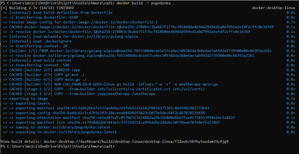
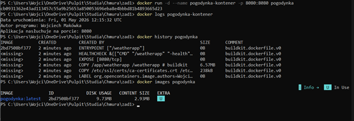
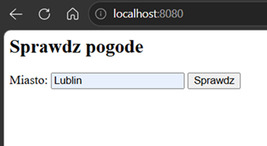
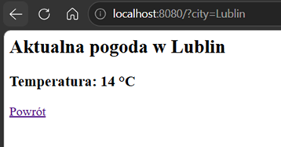
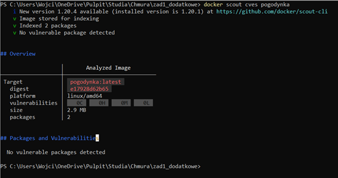
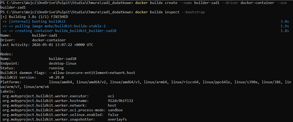
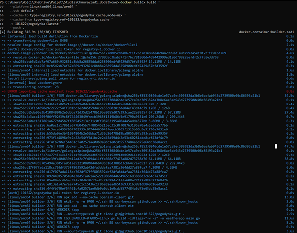
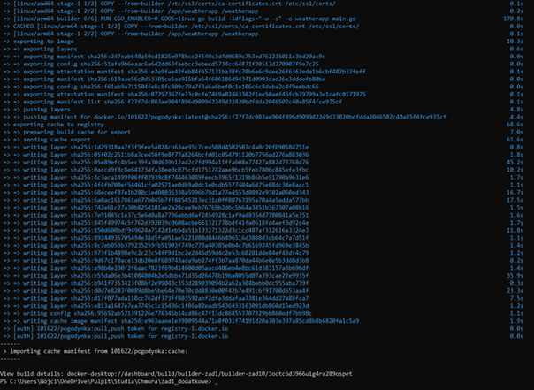
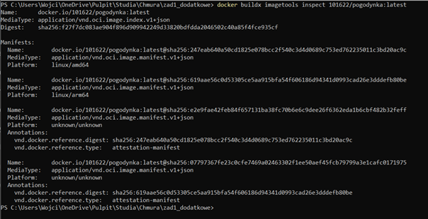

# Sprawozdanie Zadanie 1
## Język użyty do wykonania zadania to Go(Golang)

## Część obowiązkowa:
## Dockerfile:

### syntax=docker/dockerfile:1

### Użycie języka golang jako buildera
FROM golang:alpine AS builder

WORKDIR /app
COPY go.mod ./
COPY main.go ./

### Wyłączamy CGO
RUN CGO_ENABLED=0 GOOS=linux go build -ldflags="-w -s" -o weatherapp main.go

FROM scratch

LABEL org.opencontainers.image.authors="Wojciech Makowka"

### Kopia certyfikatów buildera
COPY --from=builder /etc/ssl/certs/ca-certificates.crt /etc/ssl/certs/

COPY --from=builder /app/weatherapp /weatherapp

### Port 8080
EXPOSE 8080

HEALTHCHECK --interval=30s --timeout=3s CMD ["/weatherapp", "-health"]
ENTRYPOINT ["/weatherapp"]

## 1.3. Polecenia:
## a. docker build -t pogodynka .
## b. docker run -d --name pogodynka-kontener -p 8080:8080 pogodynka
## c. docker logs pogodynka-kontener
## d. docker history pogodynka / docker images pogodynka

### Build został wykonany ponownie dla wykonania zrzutu ekranu po wcześniejszych próbach

### Wielkość obrazu na dysku = 9.73MB / Wielkość obrazu skompresowanego = 2.93MB
 
 
### Test w przeglądarce

 
 

## Część nie obowiązkowa:
## Na wszelki wypadek zmieniłem folder, w którym realizuję zadanie, aby nie zepsuć przez przypadek pierwszej części zadania

## Analiza podatności na zagrożenia wykonana w oparciu o Docker Scout - Brak zagrożeń
 
 
## Nowy Dockerfile:
### syntax=docker/dockerfile:1

### Użycie języka golang jako buildera
FROM golang:alpine AS builder
RUN apk add --no-cache openssh-client git
RUN mkdir -p -m 0700 ~/.ssh && ssh-keyscan github.com >> ~/.ssh/known_hosts
WORKDIR /app

### Pobieranie kodu z GitHuba
RUN --mount=type=ssh git clone git@github.com:101622/pogodynka.git .

### Wyłączamy CGO
RUN CGO_ENABLED=0 GOOS=linux go build -ldflags="-w -s" -o weatherapp main.go

FROM scratch

LABEL org.opencontainers.image.authors="Wojciech Makowka"

### Kopia certyfikatów buildera
COPY --from=builder /etc/ssl/certs/ca-certificates.crt /etc/ssl/certs/

COPY --from=builder /app/weatherapp /weatherapp

### Port 8080
EXPOSE 8080

HEALTHCHECK --interval=30s --timeout=3s CMD ["/weatherapp", "-health"]

ENTRYPOINT ["/weatherapp"]
 
### Konfiguracja buildera
 
 
### Budowa obrazu na dwie architektury (amd64 i arm64) i wysłanie na Docker Hub
 

 
 
## Polecenie zakończyło się sukcesem – builder uruchomił się dla obu architektur, a docker użył agenta ssh

### Sprawdzenie czy manifest zawiera deklaracje dwóch platform sprzętowych

## Został utworzony oraz został wykorzystany obraz z danymi cache

## Czy mam dodać kwiatki?
